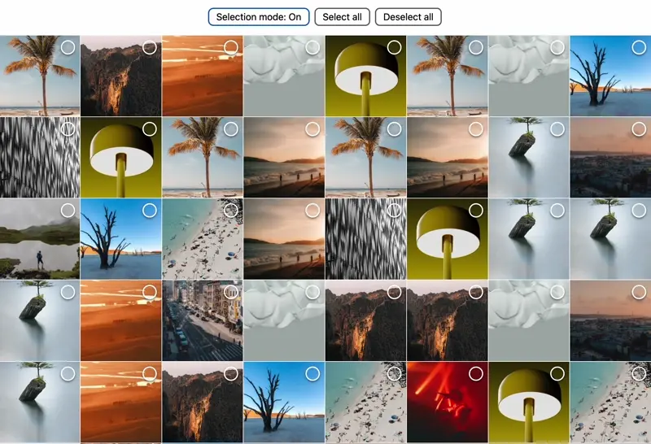

# react-index-selection-hook

A React hook that is used for selection interactions for items placed in a grid. It emulates touchscreen drag-selection interactions for mouse users.

This was created as an experiment, done as part of a larger personal project.

## Demo usage

The project includes a functioning demo.

By default, it creates 1000 elements. You can increase this value in `/demo/Demo.tsx` by modifying the `generateImageList()` arg.

How to run:

1. Clone repository
2. `pnpm i`
3. `pnpm demo`

**Note**: It doesn't currently work as intended on touchscreen devices.
